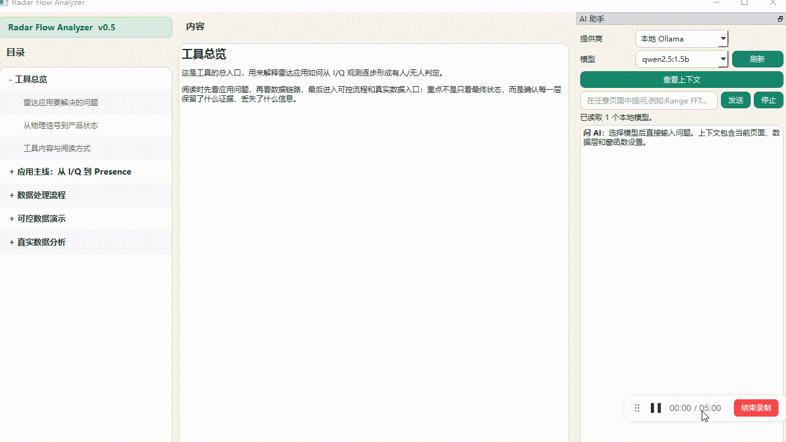

# Radar Flow Analyzer

从 I/Q 到有人/无人判定的嵌入式雷达数据链路可视化学习工具。

当前界面版本：`v0.5`，如下图所示(demo.gif)：




## 功能概览

工具围绕一条可解释的数据路径组织内容：

```text
ADC / I/Q
  -> Range FFT
  -> Doppler FFT
  -> Range-Doppler
  -> Candidate / Feature
  -> Presence
```

当前提供：

- 应用主线：从电磁波、反射、I/Q、人体运动到 Presence
- 数据处理流程：完整 I/Q、Range FFT、Doppler FFT、Range-Doppler 和候选证据
- 可控数据演示：非整数 bin、频谱泄漏、强背景下的弱目标、逐帧 Presence
- 窗函数对比：Range FFT 和 Doppler FFT 的 Rect、Hann、Hamming 对比
- 完整教学数据：工具自己的 `knowledge/data` CSV 文件
- AI 助手：本地 Ollama、DeepSeek、通义千问
- 真实数据入口：从 ADC/IQ、Doppler FFT 后数据或 Energy 特征开始分析的 TBD 页面

## 数据与边界

核心流程使用可控教学数据，页面会说明输入、矩阵形状、处理步骤、输出和可验证边界。教学仿真不代表任何具体雷达模组的真实硬件性能。

工具独立使用自己的 `knowledge` 目录。运行时不依赖 `docs`；完整 I/Q 数据位于：


## 安装

要求 Python 3.11 或更高版本。推荐在工作区根目录执行：

```powershell
py -3.11 -m pip install -e .
```

主要依赖：

- `PySide6`：桌面界面
- `PyYAML`：加载工具知识目录

## 运行

直接运行：

```powershell
py -3.11 app.py
```

完成可编辑安装后，也可以运行：

```powershell
radar-flow-analyzer
```

## 问 AI

右侧 AI 面板支持：

- 本地 Ollama 模型发现与流式回答
- DeepSeek OpenAI 兼容接口
- 通义千问 OpenAI 兼容接口
- 当前页面、数据层和窗函数上下文
- 上下文查看、编辑和本次会话保存

云端 API Key 建议使用环境变量：

```powershell
$env:DASHSCOPE_API_KEY = "your-qwen-key"
$env:DEEPSEEK_API_KEY = "your-deepseek-key"
```

云端发送前需要在界面中确认当前上下文会发送给对应服务。Key 不会写入项目文件。


## License

本项目使用 [MIT License](LICENSE)。允许个人和商业使用、修改和分发，但需要保留许可证文本。

完整的中英文免责声明见 [DISCLAIMER.md](DISCLAIMER.md)。其中的 “AS IS” 表示软件按当前状态提供，不保证没有错误，也不保证适用于特定雷达硬件、房间环境或产品目标；MIT License 不代表对检测准确率、实时性、硬件兼容性或真实场景结果提供保证。


