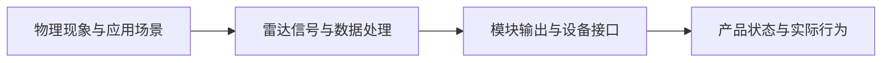

# 嵌入式雷达应用笔记：从 I/Q 到有人/无人判定 

> 本系列既是一条面向嵌入式应用开发者的雷达学习路径，也是一份围绕数据链路组织的知识总结。它不追求替代专业教材，而是连接物理现象、信号处理、模块输出和产品行为，并为进一步专题学习提供索引。

文档以雷达的数据链路为组织轴，从电磁波和 I/Q 逐步讲到信号特征、距离与速度处理以及设备输出。室内人体存在检测作为贯穿示例，用来说明人体运动、静态环境、机械干扰和安装条件如何影响真实结果。

这不是按术语和公式重新排列的雷达教材，而是把四个通常彼此分离的层次连接起来：

本系列试图填补这个断层：

> 从用户实际能够看到的数据开始分析，向下解释它的物理与算法来源，向上说明它怎样影响最终产品状态。
